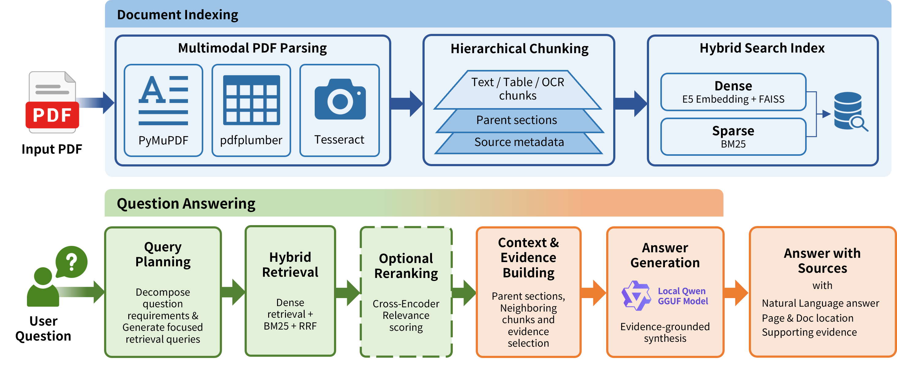

# Local PDF RAG QA System



로컬 PDF 문서를 대상으로 검색 기반 질의응답(RAG)을 수행하는 Python 프로젝트입니다.  
PDF 텍스트, 표, OCR 결과를 함께 인덱싱하고, 검색된 근거를 바탕으로 로컬 LLM이 최종 답변을 생성합니다.

예시 문서로는 관세청에서 제공하는 `유니패스 사용자가 자주 묻는 질문과 답변 (FAQ).pdf`의 일부를 발췌해 사용했습니다.  
다른 PDF도 `--pdf` 경로만 바꾸면 동일한 방식으로 실행할 수 있습니다.

---

## 1. 주요 기능

- 단일 PDF 기반 RAG 질의응답
- 외부 API 없이 로컬 모델만 사용
- PDF 텍스트 추출
- PDF 표 추출 및 Markdown 형태 인덱싱
- OCR 기반 이미지 텍스트 추출
- Dense Retrieval + BM25 + RRF 기반 1차 검색
- Cross-Encoder reranker 선택 적용
- Parent section / neighbor context 확장
- Qwen2.5-7B와 Qwen3-4B 모델 비교 실행
- reranker on/off 결과 비교 실행
- Grounded answer generation
- context window 초과 방지를 위한 composer evidence fitting
- llama.cpp CUDA abort 방지를 위한 subprocess 기반 LLM worker 실행

---

## 2. 시스템 구조

```text
PDF
├── PyMuPDF text blocks
├── pdfplumber tables
└── Tesseract OCR text

        ↓

Chunking
├── text chunk
├── table chunk
├── OCR chunk
└── parent section chunk

        ↓

Retrieval
├── Dense retrieval: multilingual-e5-small
├── Sparse retrieval: BM25
├── Score fusion: RRF
└── Optional reranking: bge-reranker-v2-m3

        ↓

Evidence Building
├── parent section expansion
├── neighbor expansion
├── answer unit extraction
└── composer evidence compression

        ↓

Answer Generation
├── Qwen2.5-7B-Instruct-GGUF
└── Qwen3-4B-GGUF

        ↓

Outputs
├── answers.md
├── answers.json
├── retrieval_debug.md
└── answers_compare.md
```

---

## 3. 실행 환경

권장 환경은 다음과 같습니다.

```bash
Python 3.10
CUDA 사용 가능 환경 권장
```

LLM 실행은 안정성을 위해 기본적으로 CPU-safe subprocess worker 방식으로 실행합니다.  
CUDA backend에서 `Aborted (core dumped)` 문제가 발생하는 환경에서는 아래 옵션을 사용하세요.

```bash
--llm_backend subprocess
--llm_force_cpu
--n_gpu_layers 0
```

OCR을 사용하려면 Python 패키지 외에 시스템 Tesseract 실행 파일이 필요합니다.

### Conda 기준 Tesseract 설치

```bash
conda install -c conda-forge tesseract
```

설치 확인:

```bash
which tesseract
tesseract --version
```

---

## 4. 파일 구조

프로젝트는 아래 구조를 기준으로 실행합니다.

```text
project/
├── 01_install_models.py
├── 02_rag_faq.py
├── requirements.txt
├── data/
│   └── 유니패스 사용자가 자주 묻는 질문과 답변 (FAQ).pdf
├── models/
│   ├── multilingual-e5-small/
│   ├── bge-reranker-v2-m3/
│   ├── qwen3-4b-gguf/
│   │   └── Qwen3-4B-Q4_K_M.gguf
│   └── qwen2.5-7b-instruct-gguf/
│       ├── qwen2.5-7b-instruct-q4_k_m-00001-of-00002.gguf
│       └── qwen2.5-7b-instruct-q4_k_m-00002-of-00002.gguf
├── cache/
└── outputs/
```

---

## 5. 설치

가상환경을 만든 뒤 필요한 패키지를 설치합니다.

```bash
conda create -n rag310 python=3.10 -y
conda activate rag310

python -m pip install --upgrade pip
python -m pip install -r requirements.txt
```

`faiss` import 오류가 발생하면 NumPy 버전을 확인하세요.

```bash
python - <<'PY'
import numpy, faiss
print("numpy:", numpy.__version__)
print("faiss import ok")
PY
```

권장 NumPy 버전은 `1.26.4`입니다.

---

## 6. 모델 준비

모델 설치 스크립트를 실행합니다.

```bash
python 01_install_models.py
```

사용 모델은 다음과 같습니다.

| 구분 | 모델 |
|---|---|
| Embedding | `intfloat/multilingual-e5-small` |
| Reranker | `BAAI/bge-reranker-v2-m3` |
| LLM 1 | `Qwen/Qwen3-4B-GGUF` |
| LLM 2 | `Qwen/Qwen2.5-7B-Instruct-GGUF` |

기본 권장 LLM은 `Qwen3-4B-GGUF Q4_K_M`입니다.  
모델 비교가 필요한 경우 `--llm_model all`을 사용하면 Qwen3-4B와 Qwen2.5-7B 결과를 함께 생성합니다.

---

## 7. 기본 실행

아래 명령은 예시 PDF를 대상으로 내장 질문 세트를 실행합니다.

```bash
python 02_rag_faq.py \
  --pdf "./data/유니패스 사용자가 자주 묻는 질문과 답변 (FAQ).pdf" \
  --rebuild --ocr --run_problem_set \
  --llm_model qwen3-4b \
  --reranker_mode on \
  --answer_mode grounded \
  --num_retrieval_queries 4 \
  --dense_k 80 \
  --bm25_k 80 \
  --candidate_k 70 \
  --top_k 16 \
  --max_context_chunks 28 \
  --max_units_per_chunk 16 \
  --max_chars_per_answer_unit 1500 \
  --unit_cross_top_n 60 \
  --max_answer_units 24 \
  --composer_token_budget 5200 \
  --composer_max_tokens 700 \
  --composer_safety_margin 512 \
  --max_composer_evidence 20 \
  --max_composer_sections 4 \
  --max_chars_per_composer_evidence 2200 \
  --n_ctx 8192 \
  --n_gpu_layers 0 \
  --llm_backend subprocess \
  --llm_force_cpu \
  --llm_n_batch 128 \
  --llm_n_ubatch 128 \
  --llm_timeout 360
```

---

## 8. 임의 PDF에 질문하기

다른 PDF 문서를 사용할 때는 `--pdf` 경로와 `--ask` 질문만 바꾸면 됩니다.

```bash
python 02_rag_faq.py \
  --pdf "./data/my_document.pdf" \
  --rebuild --ocr \
  --ask "이 문서에서 신청 절차는 어떻게 설명되어 있나요?" \
  --llm_model qwen3-4b \
  --reranker_mode on \
  --answer_mode grounded \
  --n_ctx 8192 \
  --n_gpu_layers 0 \
  --llm_backend subprocess \
  --llm_force_cpu
```

이미 한 번 `--rebuild`를 실행했다면 이후에는 캐시된 인덱스를 사용할 수 있습니다.

```bash
python 02_rag_faq.py \
  --ask "문서에서 확인할 수 있는 주요 조건은 무엇인가요?" \
  --llm_model qwen3-4b \
  --reranker_mode on \
  --answer_mode grounded
```

---

## 9. 모델 비교 실행

Qwen3-4B와 Qwen2.5-7B 결과를 비교하려면 다음 옵션을 사용합니다.

```bash
python 02_rag_faq.py \
  --pdf "./data/유니패스 사용자가 자주 묻는 질문과 답변 (FAQ).pdf" \
  --rebuild --ocr --run_problem_set \
  --llm_model all \
  --reranker_mode on \
  --answer_mode grounded \
  --n_ctx 8192 \
  --n_gpu_layers 0 \
  --llm_backend subprocess \
  --llm_force_cpu
```

생성 파일 예시:

```text
outputs/answers_qwen3-4b_reranker_on.md
outputs/answers_qwen3-4b_reranker_on.json
outputs/answers_qwen2_5-7b_reranker_on.md
outputs/answers_qwen2_5-7b_reranker_on.json
outputs/answers_compare.md
outputs/answers_compare.json
```

---

## 10. reranker 비교 실행

reranker 적용 여부에 따른 결과를 비교하려면 다음 옵션을 사용합니다.

```bash
python 02_rag_faq.py \
  --pdf "./data/유니패스 사용자가 자주 묻는 질문과 답변 (FAQ).pdf" \
  --rebuild --ocr --run_problem_set \
  --llm_model qwen3-4b \
  --reranker_mode all \
  --answer_mode grounded \
  --n_ctx 8192 \
  --n_gpu_layers 0 \
  --llm_backend subprocess \
  --llm_force_cpu
```

---

## 11. 주요 옵션

| 옵션 | 설명 |
|---|---|
| `--pdf` | 사용할 PDF 파일 경로 |
| `--rebuild` | PDF 파싱 및 인덱스 재생성 |
| `--ocr` | OCR 수행 및 OCR chunk 인덱싱 |
| `--run_problem_set` | 코드에 정의된 예시 질문 세트 실행 |
| `--ask` | 단일 질문 실행 |
| `--llm_model` | `qwen3-4b`, `qwen2.5-7b`, `all` |
| `--reranker_mode` | `on`, `off`, `all` |
| `--answer_mode` | `extractive`, `grounded` |
| `--dense_k` | dense retrieval 후보 수 |
| `--bm25_k` | BM25 후보 수 |
| `--candidate_k` | RRF 병합 후 후보 수 |
| `--top_k` | reranker 이후 상위 context 수 |
| `--max_context_chunks` | 최종 context 확장 최대 수 |
| `--composer_token_budget` | grounded composer 입력 token budget |
| `--composer_max_tokens` | 최종 답변 생성 최대 token 수 |
| `--composer_safety_margin` | context overflow 방지용 여유 token |
| `--n_ctx` | llama.cpp context window |
| `--llm_backend` | `python` 또는 `subprocess` |
| `--llm_force_cpu` | LLM worker에서 CUDA 사용 차단 |
| `--llm_timeout` | LLM worker 응답 대기 시간 |

---

## 12. 출력 파일

실행 결과는 `outputs/` 디렉터리에 생성됩니다.

```text
outputs/answers.md
outputs/answers.json
outputs/retrieval_debug.md
outputs/answers_compare.md
outputs/answers_compare.json
outputs/ocr_debug.md
```

| 파일 | 설명 |
|---|---|
| `answers.md` | 사람이 읽기 쉬운 답변 결과 |
| `answers.json` | 답변, 근거, 진단 정보 |
| `retrieval_debug.md` | 검색 후보 및 evidence 선택 과정 |
| `answers_compare.md` | 모델 또는 reranker 비교 결과 |
| `answers_compare.json` | 비교 결과의 구조화 파일 |
| `ocr_debug.md` | OCR 실행 및 OCR chunk 활용 여부 |

답변 확인:

```bash
cat outputs/answers_qwen3-4b_reranker_on.md
```

비교 결과 확인:

```bash
cat outputs/answers_compare.md
```

OCR chunk 인덱싱 여부 확인:

```bash
grep -c '"kind": "ocr"' cache/chunks.jsonl
cat outputs/ocr_debug.md
```

---

## 13. 답변 출력 형식

답변은 다음 형식으로 저장됩니다.

```text
## 질문 ID

질문: 사용자 질문

최종답: PDF 근거에 기반한 답변

근거
- 제목: PDF 파일명
- 페이지: p.번호 또는 p.시작-끝
- 위치: 섹션/텍스트블록/표/OCR locator
- 근거 발췌: 실제 PDF에서 추출된 근거 문장 또는 목록

추가설명: 필요한 경우 보충 설명, 없으면 “없음”
```

예시:

```text
## q1

질문: 개인통관고유부호를 발급하려면 어떤 앱을 설치해야 하며, 설치 후 어떤 메뉴를 선택해야 하나요?

최종답: 플레이스토어 또는 앱스토어에서 ‘모바일 관세청’ 앱을 설치한 뒤, 앱을 실행하여 [개인통관고유부호] 메뉴를 선택합니다.

근거
- 제목: 유니패스 사용자가 자주 묻는 질문과 답변 (FAQ).pdf / 페이지: p.5 / 위치: 섹션 3, p.5-8 / 근거 발췌: ‘모바일 관세청’ App 검색 후 설치
- 제목: 유니패스 사용자가 자주 묻는 질문과 답변 (FAQ).pdf / 페이지: p.5 / 위치: 텍스트블록 8 / 근거 발췌: [모바일 관세청] 앱을 실행하여 [개인통관고유부호] 선택

추가설명: 없음
```

---

## 14. Troubleshooting

### 14.1 `Requested tokens exceed context window`

최종 답변 생성 prompt가 `n_ctx`보다 큰 경우 발생합니다.

해결 방법:

```bash
--n_ctx 8192
--composer_token_budget 5200
--composer_safety_margin 512
```

그래도 발생하면 다음 값을 낮춥니다.

```bash
--max_composer_evidence 12
--max_chars_per_composer_evidence 1500
```

### 14.2 `Aborted (core dumped)` 또는 `ggml-cuda` 오류

llama.cpp CUDA backend에서 발생하는 오류입니다. 안정 실행을 위해 CPU-safe subprocess worker를 사용합니다.

```bash
--llm_backend subprocess
--llm_force_cpu
--n_gpu_layers 0
```

### 14.3 OCR이 동작하지 않음

Tesseract 실행 파일이 설치되어 있는지 확인합니다.

```bash
which tesseract
tesseract --version
```

Conda 환경에서는 다음 명령으로 설치할 수 있습니다.

```bash
conda install -c conda-forge tesseract
```

### 14.4 다른 PDF를 넣었는데 기존 답변이 나옴

인덱스 캐시가 남아 있을 수 있습니다. PDF를 바꿨다면 반드시 `--rebuild`를 사용하세요.

```bash
python 02_rag_faq.py --pdf "./data/new.pdf" --rebuild --ocr --ask "질문"
```

---

## 15. Notes

- PDF가 바뀌면 `--rebuild`를 다시 실행해야 합니다.
- OCR 결과는 검색과 증빙에는 포함되지만, 최종 답변에서는 clean text, section, table 근거가 우선됩니다.
- `--run_problem_set`은 예시 질문 세트를 실행하는 옵션입니다.
- 일반 PDF에는 `--ask` 옵션을 사용하는 것이 가장 직관적입니다.
- 외부 API를 사용하지 않으므로 모델과 PDF 파일은 모두 로컬에 있어야 합니다.
